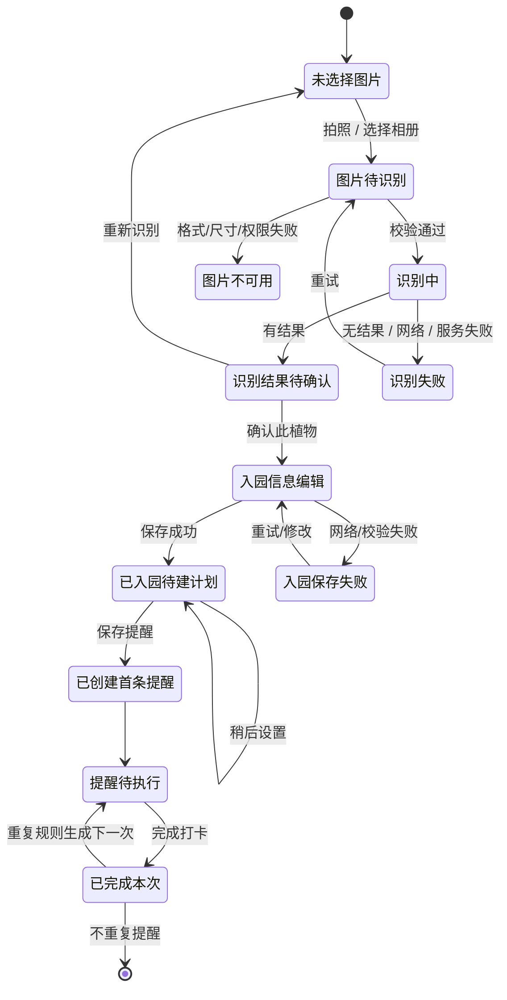

# 植の物语：识别 → 入园 → 养护计划 → 提醒打卡闭环与异常状态规范（V1）

**状态：** P0 产品规范，已确认。  
**生效日期：** 2026-08-07  
**适用范围：** Flutter 正式客户端、H5 演示、Nest API、埋点与测试用例。

---

## 1. 目标与当前实现边界

本规范把“识别植物”收敛为一个可恢复的主流程，而不是把每个页面孤立实现。用户完成一次流程后，必须能明确知道：**识别结果是否可信、是否已经加入花园、是否已经生成可执行的提醒、某条提醒是否已经完成。**

### 1.1 当前服务端已具备

| 环节 | 已有能力 |
|---|---|
| 识别 | `POST /api/v1/recognition/identify`，保存识别历史，返回候选植物及可用时的物种详情。 |
| 入园 | `POST /api/v1/garden/plants`，保存物种、昵称、位置、生长阶段、种植日期和可选照片 URL。 |
| 提醒 | `POST /api/v1/reminders` 创建单条提醒；`PATCH /:id/complete` 完成后按重复规则创建下一条提醒。 |
| 记录 | `GET /api/v1/reminders` 待办、`GET /completed` 已完成记录；植物详情可返回未完成提醒。 |

### 1.2 当前尚未实现，禁止在正式客户端承诺

1. 入园后**按养护方案自动创建提醒**；`GardenService.addPlant()` 当前只创建植物，不会创建 Reminder。
2. 从识别响应直接生成已验证的个性化养护计划；物种详情和 `careGuide` 可缺失。
3. “延期”“跳过”操作；当前 Reminder API 只有创建、修改、完成、删除。
4. 通知权限检测、系统推送调度、离线补偿和跨端时区同步。
5. 识别候选列表与用户选择候选项；当前识别接口返回单一主要结果。

**产品口径：** 在上述能力落地前，客户端只可将下一步表述为“设置第一条提醒”或“根据参考信息创建提醒”；不得显示“已自动生成养护计划”“已开启智能提醒”。

---

## 2. 主流程与不可变状态

### 2.1 状态事实来源

| 状态 | 客户端判定条件 | 服务端事实源 | 禁止用 UI 推断 |
|---|---|---|---|
| 识别结果待确认 | 本次识别请求成功，且有 `recognition.id` | Recognition 响应 | 仅凭本地预览图或缓存名称 |
| 已入园 | `POST /garden/plants` 成功并返回 `plant.id` | MyPlant | 点击“确认添加”即视为成功 |
| 已创建首条提醒 | 该 plantId 至少有一条未完成 Reminder | Reminder 列表或植物详情 | 入园成功即假设存在提醒 |
| 提醒已完成 | `PATCH /reminders/:id/complete` 成功 | Reminder `isCompleted/completedAt` | 按钮点击、动画结束 |

---

## 3. 正式客户端流程设计

### S1. 图片选择与识别

**入口：** 首页“识别植物”、空花园 CTA、提醒空态 CTA。

1. 点击“拍照”或“从相册选择”；请求相机/相册权限仅在用户主动触发后出现。
2. 本地校验格式、最小尺寸、文件大小后压缩；压缩过程中保留取消操作。
3. 调用识别接口，按钮锁定并显示进度（压缩 → 识别 → 加载养护参考），但不承诺固定 3 秒完成。
4. 展示“识别结果（待确认）”：植物名、匹配度（仅后端提供时显示）、图片、物种信息状态。
5. 用户只能选择：**确认并加入花园**、**重新识别**、**暂存到识别历史**。V1 没有候选项时，必须说明“结果仅供参考，请自行确认”。

**信息层级：** 一个主按钮“确认并加入花园”；“重新识别”是次级按钮；查看百科为文字链接。触控目标不低于 44px。

### S2. 入园信息编辑

入园表单预填识别到的物种，只让用户补充必要信息：

| 字段 | 必填 | 默认/规则 | 现有 API 字段 |
|---|---|---|---|
| 植物种类 | 是 | 识别成功且有 `species.id` 时锁定；无物种 ID 时不能直接入园 | `speciesId` |
| 昵称 | 否 | 默认物种名称，最多 64 字 | `nickname` |
| 位置 | 否 | 默认空，最多 64 字 | `location` |
| 种植日期 | 否 | 默认今天，不允许未来日期 | `plantedAt` |
| 生长阶段 | 否 | 默认 `seedling`（已购植株）；播种场景用户可改 | `currentStage` |
| 照片 | 否 | 当前仅能使用已存在的 URL；正式图片上传不在 V1 | `photoUrl` |

保存成功页必须显示两种不同状态：

- **尚无提醒：** “已加入花园。下一步设置第一条提醒。”主按钮为“设置提醒”。
- **已有提醒：** “已加入花园，首条提醒已设置为 {时间}。”主按钮为“查看植物”。

### S3. 养护计划与首条提醒

#### 当前 V1（按当前 API 能力）

“养护计划”在 UI 中只能表示用户已创建的 Reminder 集合。入园后由用户主动进入“设置第一条提醒”：

1. 选择任务类型：浇水 / 施肥 / 修剪 / 换盆 / 其他。
2. 设置首次时间和重复规则：不重复 / 每天 / 每周 / 每两周 / 每月。
3. 点击“保存提醒”后调用 `POST /reminders`；成功才显示“提醒已开启”。
4. 若物种有 `watering`、`sunlight` 或 `careGuide`，可显示为“养护参考”，不得自动转换为已生效的日程。

#### 后续“自动计划”能力的准入条件

仅在后端实现原子化“创建植物 + 计划规则 + 首批提醒”且具备规则版本、时区、失败回滚和用户确认界面后，才可以使用“自动生成养护计划”。需要新增计划数据模型，不应靠前端以名称 hash 或硬编码频率生成任务。

### S4. 提醒列表与打卡

提醒页分为：**今天**、**即将到来**、**已完成**。排序完全以 `remindAt` 为准。

- 待办行：植物名称、任务类型、预定时间、状态标签、主操作“完成”。
- 完成操作：二次确认仅在“补打卡/时间明显逾期”时出现；普通场景直接请求，按钮进入 loading，接口成功后才变为“已完成”。
- 重复提醒：接口成功返回后刷新列表；下一条提醒的时间以服务端计算为准。
- 不重复提醒：显示完成时间，并从待办移至已完成。
- 当前版本不展示“延期/跳过”为可点击动作；可显示“暂不支持，请编辑时间或删除提醒”的帮助说明，避免假能力。

---

## 4. 异常、空态与恢复规则

| 编号 | 场景 | 页面反馈 | 可恢复操作 | 数据规则 |
|---|---|---|---|---|
| E01 | 相机/相册权限拒绝 | 说明未获权限，不使用“失败”归责用户 | 打开系统设置 / 从相册选择（若可用） | 不发识别请求 |
| E02 | 文件格式、尺寸或压缩失败 | 在图片区域下显示具体原因 | 重新选择图片 | 不覆盖上一次成功结果 |
| E03 | 网络断开、超时 | 显示“网络不可用，未提交识别” | 重试 / 返回 | 不把本地预览写入识别历史 |
| E04 | 无识别结果 | “暂未识别出植物，结果不会保存” | 提供拍摄建议后重试；转手动百科搜索 | 不创建 Recognition / MyPlant |
| E05 | 识别成功但植物详情不可用 | 显示“识别已保存，养护参考暂不可用” | 重试加载详情 / 先查看识别历史 | 允许仅保存识别记录；无 `species.id` 不可直接入园 |
| E06 | 识别结果不确定 | 显示结果“待确认”及匹配度（可用时） | 重新识别 / 查看百科 / 不入园 | 不自动入园 |
| E07 | 入园表单校验失败 | 字段下方错误：字段名 + 原因 + 修复方式 | 修改后重试 | 本地草稿保留到关闭或成功 |
| E08 | 入园请求失败/重复提交 | 保留填写内容，主按钮恢复 | 重试；返回花园查询结果 | 客户端以返回的 plant.id 去重，不依据按钮状态 |
| E09 | 入园成功但创建提醒失败 | 明确“植物已加入，提醒尚未开启” | 重试创建提醒 / 稍后设置 | 绝不回滚已成功入园的植物 |
| E10 | 无任何植物 | 花园、提醒页展示空态 | “去识别植物” | 不展示虚构任务 |
| E11 | 有植物但无提醒 | 提醒页展示说明和“创建提醒” | 进入创建提醒表单 | 不称为“计划已生成” |
| E12 | 打卡请求失败 | 行保持待办，显示失败原因 | 重试 | 不提前显示完成、不创建下一条 |
| E13 | 重复提醒计算异常 | 显示“本次已完成，下一次提醒未生成”并提示联系支持 | 刷新 / 重试创建 | 后端必须保证完成与下一条生成的事务一致性（待实现） |
| E14 | 会话过期/401 | 说明登录已失效 | 登录后回到原步骤草稿 | 不丢入园表单草稿 |
| E15 | 同一植物被删除 | 任务详情提示植物已不存在 | 返回提醒列表并刷新 | 不允许继续完成/编辑该任务 |

### 4.1 统一交互要求

- 所有网络主按钮在提交期间禁用，显示文字或 spinner；超时必须提供“重试”。
- 成功、失败、空态均不得只依赖颜色传达；必须有明确文本。
- 错误文案包含：发生了什么、是否已保存、下一步怎么做。
- 关闭包含未保存入园信息的页面时，提示“继续编辑 / 放弃本次填写”。
- 本地草稿仅保存非敏感表单字段与选择的物种 ID；图片 Base64 不长期持久化。

---

## 5. 服务端补齐清单（让产品承诺可落地）

| 优先级 | 能力 | 建议实现 | 验收 |
|---|---|---|---|
| P0 | 入园幂等 | `POST /garden/plants` 增加 `Idempotency-Key` 或客户端请求键 | 连续提交只产生一盆植物 |
| P0 | 计划状态查询 | 增加“植物是否有未来提醒”的聚合字段或可靠查询 | UI 可真实显示“待设置/已设置” |
| P0 | 打卡事务 | Reminder 完成与下一条重复提醒在单一数据库事务中执行 | 任一失败不会出现半完成状态 |
| P1 | 提醒延期/跳过 | 新增专用动作及审计字段，不复用 delete | 可追踪本次延期/跳过，不破坏周期 |
| P1 | 养护计划模型 | `CarePlan/CarePlanRule`（规则版本、时区、来源、启停状态） | 自动计划与用户手动提醒可区分 |
| P1 | 自动计划生成 | 入园确认页用户确认后原子生成首批计划/提醒 | 可回滚、可重试、可解释来源 |
| P1 | 推送与权限 | 权限状态、通知调度、离线补偿、时区变更处理 | 不漏提醒、不重复提醒 |
| P2 | 多候选识别 | Recognition 返回候选列表与置信度 | 用户能显式选择后入园 |

---

## 6. 验收用例（产品 / QA / E2E）

1. 用户选择合规图片，识别成功并确认入园；入园成功后显示“待设置提醒”，不能显示“计划已生成”。
2. 识别无结果时可重试，且不创建识别历史或花园植物。
3. 识别成功但详情加载失败时，识别历史存在；无 speciesId 时入园入口禁用并说明原因。
4. 入园表单网络失败后，用户填写的昵称、位置、日期和阶段仍保留。
5. 用户主动创建每周浇水提醒；提醒列表按时间显示，完成后服务端生成下一条。
6. 打卡接口失败时，任务仍为待办；页面不展示“已完成”或下一条虚构提醒。
7. 无植物与有植物但无提醒是两个不同空态，CTA 分别指向识别和创建提醒。
8. 删除植物后刷新提醒列表，不应出现该植物的可操作提醒。
9. 401 后完成重新登录，入园表单草稿可恢复。
10. 所有主按钮在请求中不可重复提交，触控区域至少 44px。

---

## 7. H5 演示与正式客户端的分层说明

当前 H5 演示主要以 `localStorage`、前端模拟识别服务和按植物名称 hash 生成的任务展示交互，**不能作为正式 API 真实状态的证明**。在 Flutter 接入 Nest API 前，H5 中任何“识别成功、已添加、今日任务、已完成”都必须标记为演示数据；不得复制为正式客户端的业务规则。

Flutter 正式客户端实现时必须遵守：

- 调用 Nest API 后再更新状态；不直接复用 H5 的 `localStorage` 任务生成逻辑。
- `MyPlant` 创建成功后，查询 Reminder 确认是否已建首条提醒。
- Reminder 完成状态由 `PATCH /reminders/:id/complete` 的成功结果确认；界面动画不能替代服务端事实。
- 后端未提供的延期、跳过、通知权限与自动计划入口必须隐藏或展示为“即将推出”，但不能做成可用按钮。
